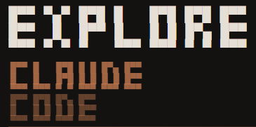
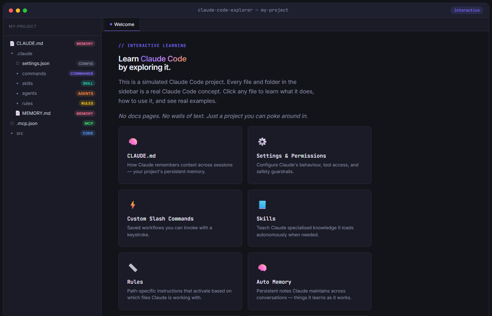

<p align="center">
  
</p>

<p align="center">
  <strong>Learn Claude Code by exploring it.</strong>
</p>

<p align="center">
  <a href="https://github.com/LukeRenton/exploreclaudecode/blob/main/LICENSE"></a>
  <a href="https://github.com/LukeRenton/exploreclaudecode/stargazers"></a>
  <a href="https://github.com/LukeRenton/exploreclaudecode/issues"></a>
  
</p>

---

An interactive website that teaches [Claude Code](https://docs.anthropic.com/en/docs/claude-code) through a simulated project you can click through. No docs pages. No walls of text. Just a project you can poke around in.

<p align="center">
  
</p>

## What is this?

Every file and folder in the sidebar is a real Claude Code concept:

| Folder / File | What you'll learn |
|---|---|
| `CLAUDE.md` | How Claude remembers context across sessions |
| `.claude/settings.json` | Configuring behaviour, tool access, and guardrails |
| `.claude/commands/` | Custom slash commands — saved workflows |
| `.claude/skills/` | Skills — folders of knowledge Claude loads autonomously |
| `.claude/agents/` | Custom subagents for specialised tasks |
| `.claude/rules/` | Path-specific instructions that activate contextually |
| `.claude/MEMORY.md` | Auto-memory — persistent notes Claude maintains |
| `.mcp.json` | MCP server configuration for extending Claude's tools |
| `src/` | Example source code showing a real project alongside config |

Click a file, read the content, understand the feature. The content *is* the config — self-describing boilerplate that explains itself.

## Getting Started

The site is static HTML/CSS/JS with zero build steps.

```bash
# Clone
git clone https://github.com/LukeRenton/exploreclaudecode.git
cd exploreclaudecode

# Serve (any static server works)
npx serve site
# or
python -m http.server -d site 8080
# or just open site/index.html in your browser
```

Then open `http://localhost:8080` (or `3000` with `npx serve`).

## Project Structure

```
exploreclaudecode/
├── site/                    # The website
│   ├── index.html           # Single-page app entry
│   ├── data/
│   │   └── manifest.json    # All tree structure + content
│   ├── js/
│   │   ├── app.js           # Main controller
│   │   ├── file-explorer.js # Sidebar tree with animated canvas connectors
│   │   ├── content-loader.js# Custom markdown renderer
│   │   ├── terminal.js      # Interactive terminal panel
│   │   ├── progress.js      # Feature completion tracker
│   │   └── icons.js         # SVG icon set
│   └── css/
│       ├── variables.css    # Design tokens
│       ├── layout.css       # App shell layout
│       ├── components.css   # Tree, content, badges
│       ├── syntax.css       # Code block theming
│       ├── terminal.css     # Terminal panel styles
│       └── void.css         # Easter egg
├── logo.png
└── README.md
```

All educational content lives in `site/data/manifest.json`. The manifest drives the entire UI — tree structure, file content, labels, badges, and feature groupings.

## How It Works

- **File explorer** — Canvas-drawn tree connector lines with staggered expand/collapse animations
- **Content renderer** — Hand-rolled markdown parser supporting frontmatter tables, fenced code blocks, inline code, tables, lists, and links
- **Terminal panel** — Interactive Claude Code terminal simulation with working commands
- **Progress tracker** — Tracks which features you've explored across the session
- **Easter egg** — Try clicking the minimize button

## Contributing

Contributions welcome — especially for:

- New educational content for Claude Code features
- Accessibility improvements
- Mobile experience refinements
- Translations

To add or modify content, edit `site/data/manifest.json`. Each tree node has a `content` field containing the markdown that renders when you click it.

## License

[MIT](LICENSE)
